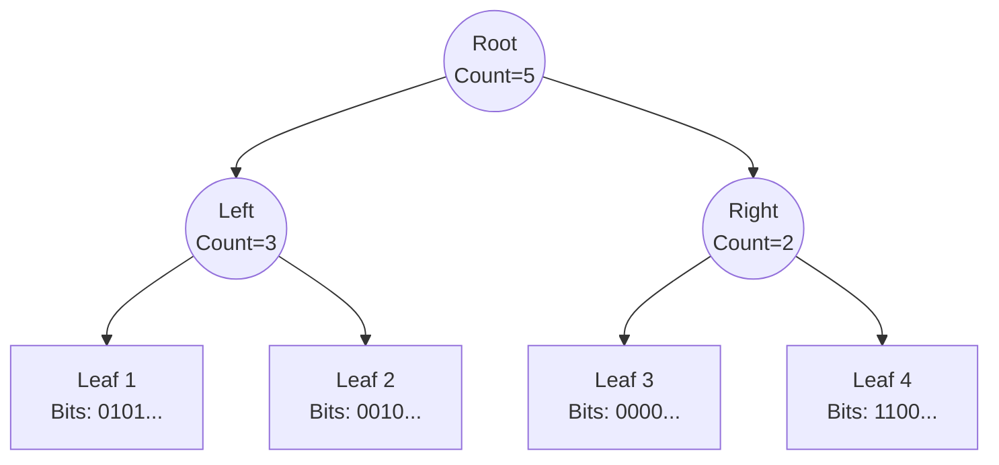

# Work Contracts Architecture

The `WorkContractGroup` is the core scheduling primitive in EntropyCore. The concept of Work Contracts was created by **Michael Maniscalco**.

<iframe width="560" height="315" src="https://www.youtube.com/embed/oj-_vpZNMVw?si=4JZnrMMmAtBpuhj2" title="YouTube video player" frameborder="0" allow="accelerometer; autoplay; clipboard-write; encrypted-media; gyroscope; picture-in-picture; web-share" referrerpolicy="strict-origin-when-cross-origin" allowfullscreen></iframe>

## Lock-Free Signal Tree

Unlike traditional job systems that use global concurrent queues (high contention) or work-stealing deques (complex to balance), Entropy uses a **Lock-Free Binary Signal Tree**.

### The Problem it Solves
In a high-throughput framework, thousands of tasks may complete or be created per frame. If every thread fights for a single `atomic<head>` or `mutex`, synchronization overhead becomes the bottleneck.

### The Solution
The `SignalTree` provides a spatial distribution of atomic state.

*   **Leaf Nodes**: Each leaf is an `atomic<uint64_t>` representing 64 distinct task slots.
*   **Internal Nodes**: Represent the "aggregate presence" of work in their subtree.
*   **Fairness**: A `bias` bitmask rotates the search path (Left vs. Right) at each node to prevent starvation.

1.  **Set (O(log N))**: A thread marks a bit in a leaf. If the bit was 0, it atomically increments parent counters up to the root.
2.  **Select (O(log N))**: A worker descends the tree. At each node, it uses the `bias` to choose a path with `count > 0`.
3.  **Contention Free**: Multiple threads can traverse different branches or operate on different atomic cache lines of the tree simultaneously.

## Lifecycle

1.  **Allocation**: A `WorkContractHandle` is created from a free slot.
2.  **Schedule**: The slot index is set in the `SignalTree` (`_readyContracts`).
3.  **Selection**: A worker calls `selectForExecution()`, traversing the tree to find a ready slot.
4.  **Execution**: The task runs.
5.  **Completion**: The slot is returned to the free list, or re-scheduled.

## Generations

To prevent ABA problems and use-after-free bugs (where a handle refers to a slot that has been reused for a different task), each slot maintains a monotonically increasing `generation` counter. A `WorkContractHandle` is only valid if its generation matches the slot's current generation.
