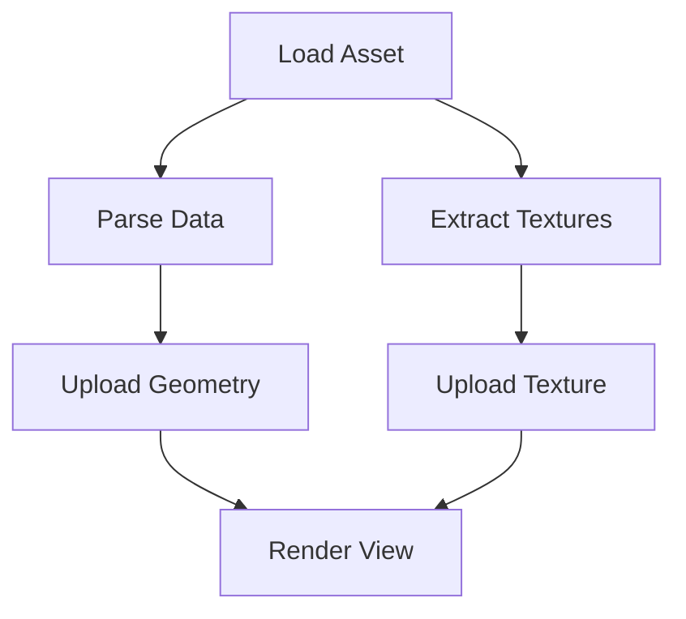

# Work Graphs

## Overview

Work Graphs provide a high-level abstraction for managing complex, interdependent tasks. While `WorkContracts` handle the execution of individual atoms of work, `WorkGraph` orchestrates the **flow** of that work.

A Work Graph is a **Directed Acyclic Graph (DAG)** where:
*   **Nodes** contain work (contracts).
*   **Edges** represent dependencies (Node B cannot start until Node A completes).



### Key Concepts

*   **Dependencies**: Automatic scheduling of dependent nodes upon completion of prerequisites.
*   **Concurrency**: Independent branches of the graph execute in parallel automatically.
*   **Yielding/Retrying**: Nodes can voluntarily yield execution to be retried later (e.g., waiting for a resource).

## Usage

### 1. Defining the Graph
You build the graph by adding nodes and defining dependencies. This is typically done during initialization.

```cpp
#include <EntropyCore/Concurrency/WorkGraph.h>

// Initialize graph associated with a work group
EntropyEngine::Core::Concurrency::WorkGraph graph(&myContractGroup);

// Add Nodes
auto loadAsset = graph.addNode([]() { loadMesh(); }, "LoadAsset");
auto preparePhysics = graph.addNode([]() { initBody(); }, "InitPhysics");
auto renderParam = graph.addNode([]() { setupMaterial(); }, "SetupMat");

// Define Dependencies
// Physics and Render can only start after Asset is loaded
graph.addDependency(loadAsset, preparePhysics);
graph.addDependency(loadAsset, renderParam);
```

### 2. Yielding and Retry Logic
Sometimes a task cannot complete immediately (e.g., waiting for an async I/O operation or a GPU fence). Instead of blocking the thread, the node can **yield**.

To use yield logic, use `addYieldableNode` instead of `addNode`.

```cpp
auto processData = graph.addYieldableNode([]() -> WorkResultContext {
    if (!isDataReady()) {
        // Yield!
        // The graph will reschedule this node to run again later.
        // The worker thread is freed to do other work in the meantime.
        return WorkResultContext::yield();
    }

    processTheData();
    return WorkResultContext::complete();
}, "ProcessData");
```

**Yield loop**: The graph handles the rescheduling. It effectively spins (or sleeps/backs-off depending on implementation) carefully until the condition is met, without blocking a thread slot permanently.

### 3. Execution
Scheduling the graph triggers the root nodes (those with no unsatisfied dependencies).

```cpp
// Kick off the graph
graph.execute();

// Wait for the entire graph to complete
graph.wait();

// Reset for next frame/use
graph.reset();
```

## Advanced: Thread Affinity
You can constrain nodes to specific threads (e.g., Main Thread) if they interact with systems that are not thread-safe.

```cpp
graph.addNode([]() { userInterface.update(); }, "UI",
              nullptr, ExecutionType::MainThread);
```
