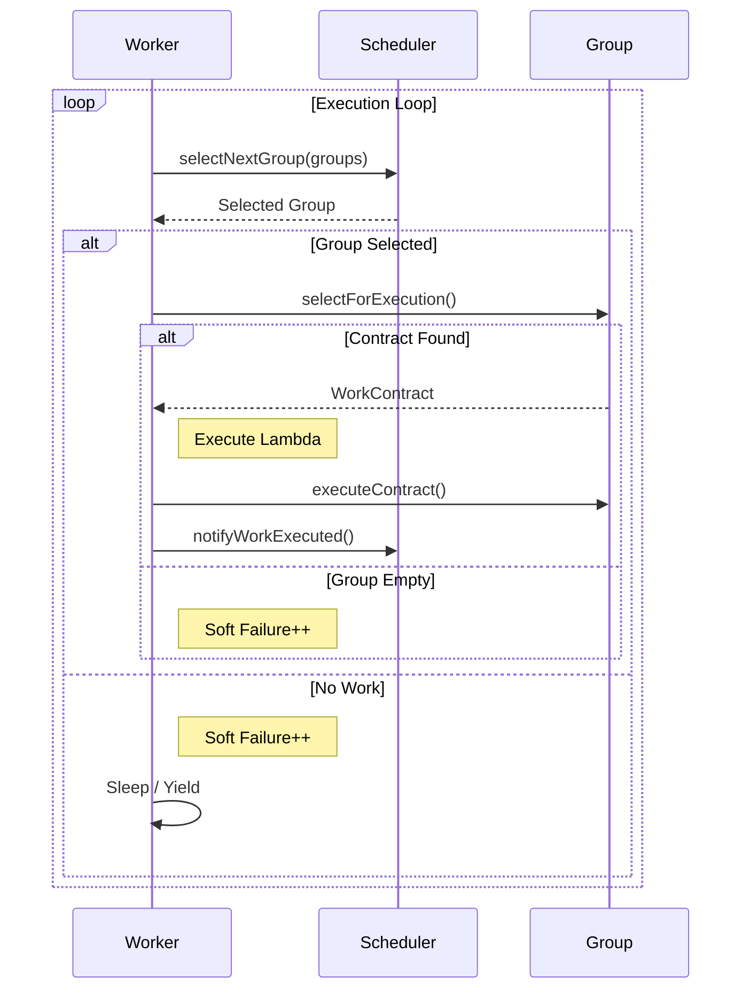

# Work Service

## Overview

The `WorkService` is the layout engine of the Entropy Concurrency model. While `WorkContracts` define the work and `WorkGroups` store it, the `WorkService` provides the **Worker Threads** that actually execute it.

It separates **Execution** (threads, affinity, loop management) from **Scheduling** (deciding *which* group to work on next).

### Key Responsibilities
*   **Thread Pool Management**: Spawns and manages worker threads based on core count.
*   **Main Thread Integration**: Provides methods to execute work on the main thread (for `ExecutionType::MainThread` contracts).
*   **Pluggable Scheduling**: Delegating work selection to an `IWorkScheduler`.

## IWorkScheduler

The scheduler is the "brain" of the Work Service. Worker threads sit in a loop asking the scheduler: *"What should I do next?"*.

The interface is defined in `IWorkScheduler.h`.

```cpp
struct ScheduleResult {
    WorkContractGroup* group; // The group to steal work from
    bool shouldSleep;         // Hint to sleep if no work found
};

virtual ScheduleResult selectNextGroup(const std::vector<WorkContractGroup*>& groups) = 0;
```

### Scheduler Types

1.  **AdaptiveRankingScheduler** (Default): Sophisticated scheduler that learns which groups produce the most high-value work and prioritizes them.
2.  **RoundRobinScheduler**: Simple, fair iteration through all groups.
3.  **RandomScheduler**: Stochastic selection, useful for stress testing or very uniform workloads.
4.  **SpinningDirectScheduler**: Low-latency scheduler for specific high-performance needs.

## Usage

### 1. Initialization
You typically create one `WorkService` for the entire application.

```cpp
#include <EntropyCore/Concurrency/WorkService.h>

// Configure the service
EntropyEngine::Core::Concurrency::WorkService::Config config;
config.threadCount = 0; // 0 = Auto-detect hardware concurrency

// Create with default scheduler
EntropyEngine::Core::Concurrency::WorkService service(config);
```

### 2. Custom Scheduler
You can inject a custom scheduler strategy during construction.

```cpp
auto roundRobin = std::make_unique<RoundRobinScheduler>(schedulerConfig);
EntropyEngine::Core::Concurrency::WorkService service(config, std::move(roundRobin));
```

### 3. Registering Groups
The service needs to know which groups to poll.

```cpp
service.addWorkContractGroup(&physicsGroup);
service.addWorkContractGroup(&renderingGroup);
```

### 4. Running
Start the background threads.

```cpp
service.start();

// ... Application Loop ...

service.stop();
```

### 5. Main Thread Work
The main thread must manually process work assigned to it (e.g., UI updates).

```cpp
// In your main loop
// In your main loop
while (service.hasMainThreadWork()) {
    // Execute a batch of main thread tasks
    service.executeMainThreadWork(10);
}
```

## Architecture Details

### The Worker Loop
Each worker thread runs a continuous loop that balances high-performance polling with CPU-efficient sleeping.



### Failure Handling & Adaptive Sleep
To prevent burning 100% CPU when idle, the service uses an adaptive backoff strategy:
1.  **Spinning**: For the first `maxSoftFailureCount` (default 5) failures, the thread just yields.
2.  **Sleeping**: Once the failure count is exceeded, the thread waits on a `condition_variable`.
3.  **Waking**: Any new work submission notifies the condition variable, waking a worker immediately.

### Configuration
You can tune this behavior via `WorkService::Config`:
*   `threadCount`: Number of workers (0 = auto-detect hardware concurrency).
*   `maxSoftFailureCount`: How many times to try finding work before sleeping.
*   `failureSleepTime`: (Legacy) Nanoseconds to sleep (superseded by condition variables in modern versions).
