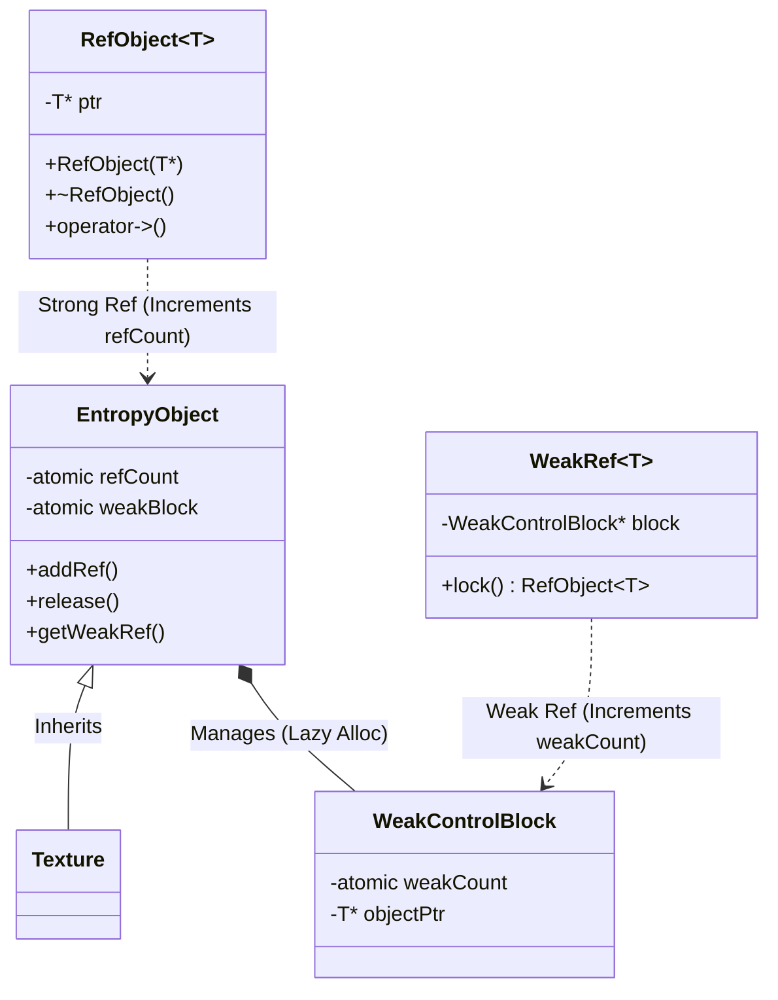

# Memory Model Architecture

EntropyCore implements a high-performance hybrid memory model designed for high-throughput application workloads. It prioritizes cache coherence, minimal allocation overhead, and thread safety.

## Core Hierarchy

The memory model is built around **Intrusive Reference Counting**, where the reference count is embedded directly in the object. This avoids the separate control block allocation required by `std::shared_ptr`.

## Design Rationale

`RefObject<T>` is provided as a specialized smart pointer for `EntropyObject` descendants. Since `EntropyObject` already contains an embedded (intrusive) reference count, `RefObject` avoids the need for a separate control block allocation.

*   **Intrusive**: The reference count is stored within the object itself.
*   **Convenience**: Provides familiar smart pointer semantics (`->`, `*`, copy/move) for engine types.
*   **Interop**: Valid `RefObject`s can be converted to `std::shared_ptr` when exposing objects to external libraries that require standard pointers.

### When to use
*   **Internal Engine Code**: Use `RefObject<T>` for all `EntropyObject` types.
*   **External APIs**: Use `std::shared_ptr<T>` when integrating with 3rd party libraries.
