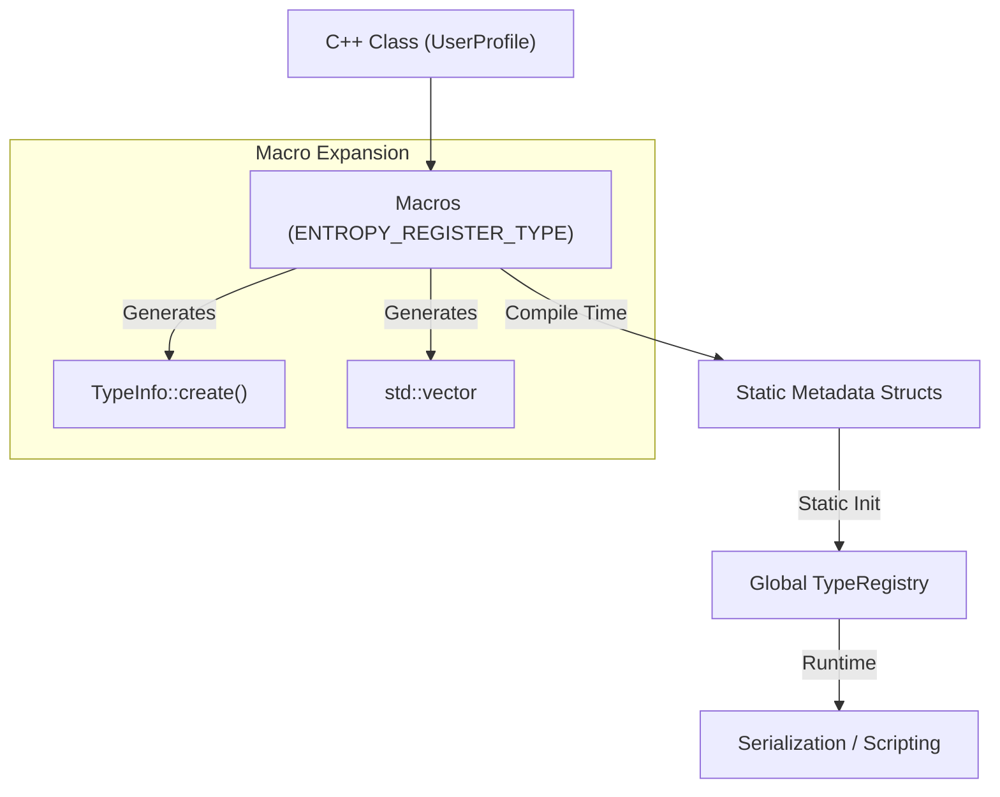

# Type System Architecture

The Entropy Type System provides static reflection and runtime introspection for C++ classes. It creates a bridge between static C++ types and dynamic systems like Scripting and Serialization.

## Reflection Pipeline

The system uses a macro-based approach to register types at compile-time. These macros expand into static registration structures that populate the `TypeRegistry` at startup.

## Core Components

### `TypeInfo`
Stores metadata for a single type.
*   **Name**: String identifier (via `getStaticTypeName`).
*   **TypeID**: Unique 64-bit hash.
*   **Fields**: List of member variables (`FieldInfo`).
*   **Size/Alignment**: Memory layout details.

### `FieldInfo`
Metadata for a single member variable.
*   **Name**: "creditBalance".
*   **Offset**: Byte offset from `this` (via `offsetof`).
*   **TypeID**: ID of the field's type.
*   **IsExtension**: Flag for USD schema extensions (via `ENTROPY_FIELD_EXTENSION`).

## Serialization Workflow

The primary use case for the type system is zero-boilerplate serialization.

1.  **Traverse**: The `Serializer` iterates over `TypeInfo::getFields()`.
2.  **Access**: Uses `offset` to read data from the instance pointer.
3.  **Write**: Dispatches to the appropriate writer based on the field's `TypeID`.
