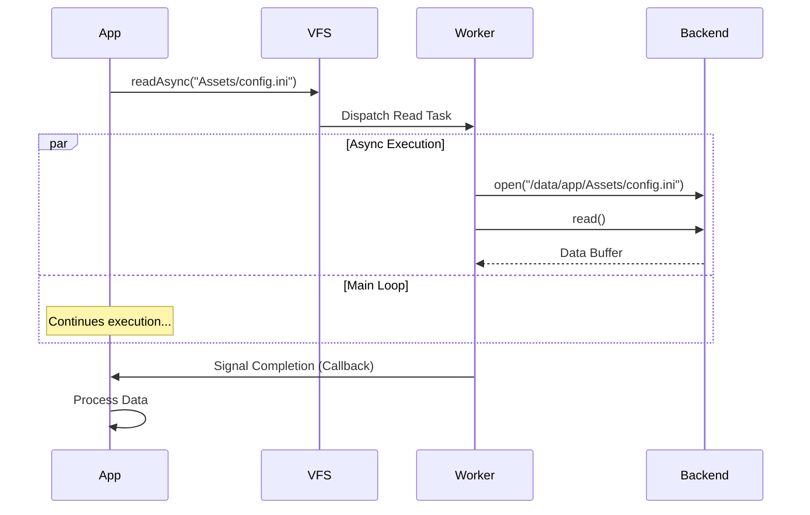

# Virtual File System (VFS) Architecture

The VFS provides a unified, platform-agnostic interface for file I/O. It abstracts physical storage (Disk, Network, RAM) behind **Mount Points** and supports **Non-blocking I/O** via the Work Contract system.

## Components

1.  **VirtualFileSystem**: The central manager. Routes paths to the correct backend.
2.  **FileSystemBackend**: Interface for storage implementations (`Local`, `Memory`, `Network`).
3.  **FileHandle**: RAII wrapper for an open file resource.

## Async Read Flow

Reading a file asynchronously avoids blocking the main thread. This flow uses a `WorkContract` to dispatch the read operation to an appropriate worker thread.

## Mount Point Configuration

The VFS resolution logic works by matching prefixes.

| Virtual Path | Mount Point | Resolved Path | Backend |
| :--- | :--- | :--- | :--- |
| `Assets/Textures/Logo.png` | `Assets` -> `./Data/Assets` | `./Data/Assets/Textures/Logo.png` | `LocalBackend` |
| `Cache/Shader.bin` | `Cache` -> `Memory` | `[RAM Address]` | `MemoryBackend` |
| `Config.ini` | `ROOT` | `./Config.ini` | `LocalBackend` |

## Writing & Locking

To prevent data corruption, the VFS implements advisory write locking.
*   **Serialized Writes**: Writes to the same path are queued sequentially.
*   **Timeout**: If a lock is held too long (e.g., writer crash), it expires automatically.
