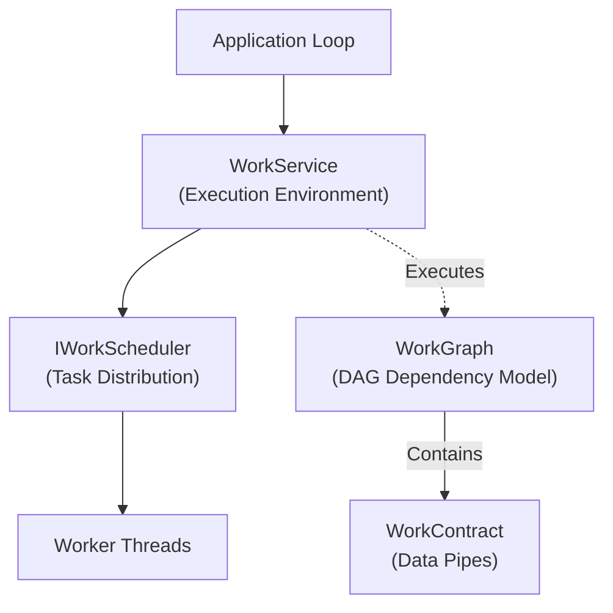

# Architecture Overview

EntropyCore provides the fundamental building blocks for the framework, focusing on high-performance concurrency and platform abstraction.

## Subsystems

### [Concurrency](./Concurrency/)
The core work execution model.
*   **[Work Contracts](./Concurrency/WorkContracts.md)**: Lock-free producer-consumer communication protocol.
*   **[Work Graphs](./Concurrency/WorkGraphs.md)**: DAG-based task scheduling with automatic parallelism.
*   **[Work Service](./Concurrency/WorkService.md)**: The engine's main loop, thread pool management, and execution environment.

### [Memory Model](./Memory/)
Hybrid memory management strategy.
*   **Intrusive RefCounting**: Minimizing allocation overhead.
*   **Weak References**: Cycle breaking and safe observation.

### [Virtual File System](./VirtualFileSystem/)
Unified I/O abstraction.
*   **Mount Points**: Virtual-to-physical path mapping.
*   **Async I/O**: Non-blocking integration with WorkScheduler.

### [Type System](./TypeSystem/)
Static reflection and runtime introspection.
*   **Reflection**: Macro-based metadata generation.
*   **Serialization**: Zero-boilerplate data persistence.
