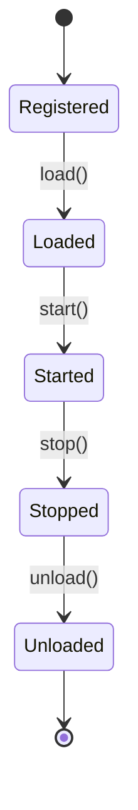
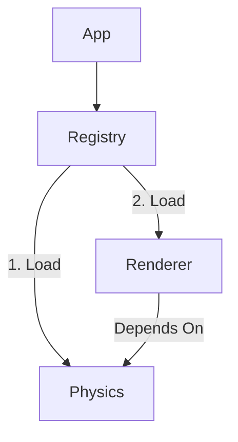

# Feature: Core Services

EntropyCore provides foundational services for application lifecycle and communication.

## Service Registry (`EntropyServiceRegistry`)
The central orchestrator for pluggable subsystems. It manages the lifecycle and dependencies of all registered services.

### Lifecycle
Services transition through specific states, orchestrated by the registry:



### Dependency Resolution
Services declare dependencies using `dependsOnTypes()`. The registry uses a topological sort to ensure services are initialized in the correct order.



### Implementing a Service

Inherit from `EntropyService` and implement the lifecycle hooks.

```cpp
#include <EntropyCore/Core/EntropyService.h>

class PhysicsService : public EntropyService {
public:
    ENTROPY_REGISTER_TYPE(PhysicsService);

    // Identity
    const char* id() const override { return "com.entropy.physics"; }
    const char* name() const override { return "Physics Service"; }

    // Lifecycle
    void initialize() {
        Log::info("Initializing Physics Subsystem...");
    }
    void start() override {
        Log::info("Starting Physics Simulation...");
    }
    void stop() override {
        Log::info("Stopping Physics...");
    }

    // Dependencies
    std::vector<TypeSystem::TypeID> dependsOnTypes() const override {
        return { TypeSystem::createTypeId<WorkService>() };
    }
};
```

### Usage

```cpp
// 1. Access Registry via Application
auto& app = EntropyApplication::shared();
auto& registry = app.services();

// 2. Register Service
registry.registerService(makeRef<PhysicsService>());

// 3. Lifecycle (typically handled by Application internally)
// registry.loadAll();
// registry.startAll();

// 4. Access Service
auto physics = registry.get<PhysicsService>();
```

## Event Bus
A type-safe publish-subscribe system for decoupled communication. Designed to be embedded in objects (Application, UIWidget) rather than global.

```cpp
// 1. Define Event
struct UserLoggedInEvent { int userId; };

// 2. Embed EventBus in your class
class Application {
public:
    EventBus events;
};

// 3. Subscribe
app.events.subscribe<UserLoggedInEvent>([](const auto& e) {
    Log::info("User {} logged in", e.userId);
});

// 4. Publish
app.events.publish(UserLoggedInEvent{1});
```

## Timer Service
Provides high-precision timing and scheduling. Accessed via `EntropyApplication`.

```cpp
auto& app = EntropyApplication::shared();
auto timers = app.services().get<TimerService>();

// Schedule a callback in 5 seconds
timers->scheduleTimer(5.0f, []() {
    Log::info("5 seconds passed");
});
```
